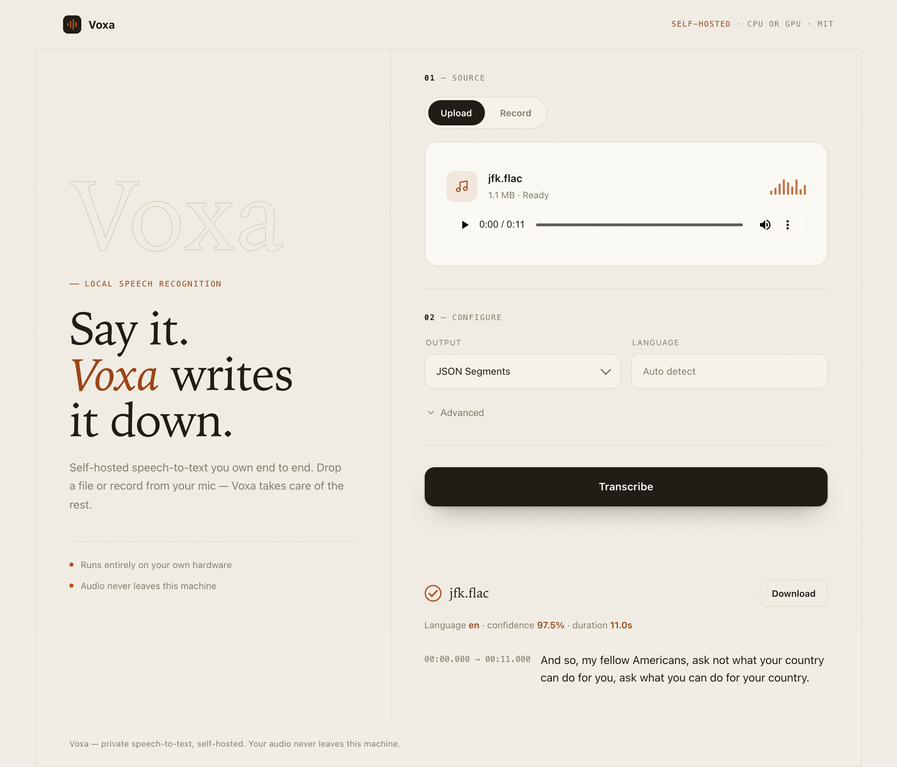

<div align="center">

# 🎙️ Voxa

### Self-hosted speech-to-text you own end to end

Whisper-grade transcription behind a clean HTTP API and a polished web UI —
running entirely on **your** hardware. Your audio never leaves your server.

<p>
  
  
  
  
  
  
</p>



</div>

---

## Table of contents

- [Why Voxa](#why-voxa)
- [Features](#features)
- [Quickstart](#quickstart)
  - [Docker (recommended)](#docker-recommended)
  - [Local Python](#local-python)
- [API reference](#api-reference)
- [Configuration](#configuration)
- [Use as a library](#use-as-a-library)
- [Architecture](#architecture)
- [Benchmark](#benchmark)
- [Scaling to 100× concurrent users](#scaling-to-100-concurrent-users)
- [Project layout](#project-layout)
- [Tests](#tests)
- [License & attribution](#license--attribution)

---

## Why Voxa

Most speech-to-text is a cloud API: you upload private audio, you pay per minute,
and you trust someone else's servers. Voxa flips that. It's a single, self-hosted
service that turns audio into structured text — with **word-level timestamps**,
**subtitle exports**, and a **drag-and-drop UI** — on a box you control.

Voxa ships its own transcription engine in [`voxa/engine/`](voxa/engine/), so it
has **no external `faster-whisper` dependency** — clone it, install, run, it stands
on its own. Credit where it's due: the engine design is inspired by
[faster-whisper](https://github.com/SYSTRAN/faster-whisper) and CTranslate2 — see
[License & attribution](#license--attribution).

---

## Features

- 🌐 **HTTP API** — `POST /transcribe` (multipart upload), `GET /health`.
- 🎨 **Web UI** — drag-and-drop, served by the same server, zero build step.
- 📝 **4 output formats** — JSON (segments + timestamps), plain text, SRT, WebVTT.
- ⏱️ **Word-level timestamps** — per-word start/end when you want them.
- 🔇 **VAD silence filtering** — skip dead air via Silero VAD.
- 🌍 **99 languages** — auto-detected, or force one.
- ⚡ **CPU or GPU** — int8 on CPU is first-class; CUDA 12 + cuDNN 9 for GPU.
- 🔒 **Private by default** — audio is processed locally and never uploaded anywhere.

---

## Quickstart

### Docker (recommended)

```bash
docker build -f Dockerfile.voxa -t voxa .
docker run --rm -p 8000:8000 -v hf-cache:/root/.cache/huggingface voxa
```

Open **http://localhost:8000** for the UI, or call the API:

```bash
curl -F "file=@audio.mp3" http://localhost:8000/transcribe
```

The `hf-cache` volume persists the downloaded model across restarts. The image is
CPU + int8 by default; for GPU, swap the base image (see `Dockerfile.voxa`).

### Local Python

```bash
pip install -r requirements.txt
python -m voxa.server            # serves http://127.0.0.1:8000
```

Python 3.9+. GPU needs CUDA 12 + cuDNN 9 (via `ctranslate2`); CPU + int8 needs
nothing extra.

---

## API reference

### `POST /transcribe`

Multipart upload. Returns the transcript in the requested format with the correct
`Content-Type`.

| Param | In | Type | Default | Description |
|-------|----|------|---------|-------------|
| `file` | multipart | file | — | Audio/video file (mp3, wav, flac, m4a, ogg, …). **Required.** |
| `format` | query | enum | `json` | `json` · `txt` · `srt` · `vtt`. |
| `language` | query | string | auto | ISO-639-1 code (e.g. `en`). Omit to auto-detect. |
| `word_timestamps` | query | bool | `false` | Include per-word start/end times. |
| `vad` | query | bool | `true` | Silero VAD silence filtering. |

**Responses:** `200` with the transcript · `400` bad/missing audio · `422` invalid
params.

```bash
# JSON with word timestamps, forced English
curl -F "file=@meeting.m4a" \
  "http://localhost:8000/transcribe?format=json&language=en&word_timestamps=true"

# SRT subtitles
curl -F "file=@lecture.mp3" "http://localhost:8000/transcribe?format=srt" -o out.srt
```

<details>
<summary>Example JSON response</summary>

```json
{
  "segments": [
    { "start": 0.0, "end": 3.6, "text": " And so my fellow Americans,", "words": null }
  ],
  "info": { "language": "en", "language_probability": 0.99, "duration": 11.0 }
}
```
</details>

### `GET /health`

Cheap liveness + config check (no inference).

```json
{ "status": "ok", "model": "base", "device": "cpu" }
```

---

## Configuration

Set via environment variables (all optional):

| Variable | Default | Description |
|----------|---------|-------------|
| `VOXA_HOST` | `127.0.0.1` | Bind address (`0.0.0.0` in Docker). |
| `VOXA_PORT` | `8000` | Port. |
| `VOXA_MODEL` | `base` | Model size or HF id — see table below. |
| `VOXA_DEVICE` | `cpu` | `cpu` or `cuda`. |
| `VOXA_COMPUTE_TYPE` | `int8` | `int8`, `int8_float16`, `float16`, `float32`. |

**Model options:** `tiny(.en)`, `base(.en)`, `small(.en)`, `medium(.en)`,
`large-v1/v2/v3`, `distil-*`, `large-v3-turbo` / `turbo`. Smaller = faster + less
memory; larger = more accurate. Models auto-download from the Hugging Face Hub on
first use and are cached.

---

## Use as a library

```python
from voxa import Transcriber, formats

t = Transcriber("base", device="cpu", compute_type="int8")   # model loaded once
result = t.transcribe("audio.mp3", word_timestamps=True)

print(result.info.language, result.info.duration)
for seg in result.segments:
    print(f"[{seg.start:.2f} -> {seg.end:.2f}] {seg.text}")

open("out.srt", "w").write(formats.to_srt(result))
```

`Transcriber` loads the model once and reuses it — reusing one instance across
calls is the whole performance game.

---

## Architecture

```
                         ┌─────────────────────────────────────────┐
   audio (upload) ─────▶ │  voxa/api.py   FastAPI  (one Transcriber │
                         │                loaded at startup)        │
                         └───────────────┬─────────────────────────┘
                                         ▼
                         ┌─────────────────────────────────────────┐
                         │  voxa/core.py  Transcriber.transcribe()  │
                         │  consumes the engine generator once      │
                         └───────────────┬─────────────────────────┘
                                         ▼   voxa/engine/
     decode_audio ─▶ FeatureExtractor ─▶ [VAD] ─▶ CTranslate2 ─▶ tokenizer
      (PyAV, 16kHz)    (STFT → log-mel)  (Silero)  (beam search)   (BPE)
                                         ▼
                         ┌─────────────────────────────────────────┐
                         │  voxa/types.py   TranscriptResult        │
                         │  voxa/formats.py json / txt / srt / vtt  │
                         └─────────────────────────────────────────┘
```

The web UI (`voxa/web/index.html`) is a single static file served by the same
FastAPI app — native `<input type=file>` + `fetch()`, no framework, no bundler.

---

## Benchmark

Real numbers on **this machine** (Apple M1, CPU + int8, no GPU), measured by
[`benchmark/voxa_benchmark.py`](benchmark/voxa_benchmark.py) on the JFK sample
(11.0 s) and progressively noisier copies (additive Gaussian noise at a given
signal-to-noise ratio). WER is against a fixed reference; RTF (realtime factor) is
audio-seconds ÷ wall-seconds — **higher is faster**.

| Model | Sample | WER | RTF | Peak RAM |
|-------|--------|----:|----:|---------:|
| `tiny` | clean | 0.0% | 8.4× | 305 MB |
| `tiny` | noisy @ 5 dB | 0.0% | 10.9× | 323 MB |
| `tiny` | noisy @ 0 dB | **18.2%** | 17.8× | 360 MB |
| `base` | clean | 0.0% | 11.5× | 561 MB |
| `base` | noisy @ 5 dB | 0.0% | 11.6× | 561 MB |
| `base` | noisy @ 0 dB | **0.0%** | 9.5× | 561 MB |

**Reading it:** both models run ~8–18× faster than realtime on a laptop CPU. On
clean and lightly-noisy audio, `tiny` ties `base` at 0% WER using ~200 MB less RAM.
The gap appears at **0 dB SNR** (noise as loud as the speech): `tiny` degrades to
18.2% WER while `base` still holds 0% — the accuracy-for-memory tradeoff, measured
not assumed.

> ℹ️ Peak RAM is process-peak (`ru_maxrss`, monotonic), so treat it as an upper
> bound per model, not an isolated per-row figure. Reproduce with
> `python benchmark/voxa_benchmark.py`.

---

## Scaling to 100× concurrent users

Today Voxa loads one model and transcribes one request at a time in a threadpool —
right for self-host, not for scale. To take it to ~100× concurrent load I'd:

- Put a **request queue** in front of the model and switch the hot path to
  `BatchedInferencePipeline` (already in `voxa/engine/`) so many clips go through a
  single forward pass instead of one at a time.
- Run **multiple uvicorn workers**, each owning its **own** model instance — Whisper
  models aren't safe to share across threads — behind a load balancer.
- Add a small **GPU pool**: one model per device, route by least-loaded.
- Make transcription an **async job** (`202 Accepted` + poll/webhook) so slow clips
  don't hold a connection open.
- **Cache by audio content hash** to skip re-transcribing duplicates.

None of that changes the public surface — it all lives behind `/transcribe`.

---

## Project layout

```
voxa/
├── __init__.py        Transcriber (lazy import), types, formats
├── core.py            Transcriber — loads the engine once, reuses it
├── types.py           Segment / Word / Info / TranscriptResult (stdlib only)
├── formats.py         json / txt / srt / vtt (stdlib only)
├── api.py             FastAPI app (one Transcriber at startup)
├── server.py          uvicorn entrypoint (python -m voxa.server)
├── engine/            transcription engine (inspired by faster-whisper)
│   ├── transcribe.py  audio.py  vad.py  tokenizer.py  feature_extractor.py  utils.py
│   ├── assets/        Silero VAD model
│   └── LICENSE        third-party notice
└── web/index.html     single-file web UI
benchmark/             voxa_benchmark.py
tests/                 voxa tests (+ conftest, data)
Dockerfile.voxa        single self-host container
```

---

## Tests

```bash
pip install pytest httpx
pytest tests/
```

Format and API tests run **without loading a model** (fake segments / mocked
`Transcriber`), so they stay fast and CPU-friendly.
[`tests/test_voxa_core.py`](tests/test_voxa_core.py) includes one real tiny-model
transcription that downloads on first run. Current status: **15/15 passing**.

---

## License & attribution

Voxa is **MIT** licensed — see [LICENSE](LICENSE).

Credit to the projects that inspired the engine design: **faster-whisper**,
**OpenAI Whisper**, and **CTranslate2**. Third-party notices are kept in
[NOTICE](NOTICE) and [`voxa/engine/LICENSE`](voxa/engine/LICENSE).

<div align="center">
<sub>Inspired by <a href="https://github.com/SYSTRAN/faster-whisper">faster-whisper</a>,
<a href="https://github.com/openai/whisper">OpenAI Whisper</a>, and
<a href="https://github.com/OpenNMT/CTranslate2">CTranslate2</a>.</sub>
</div>
